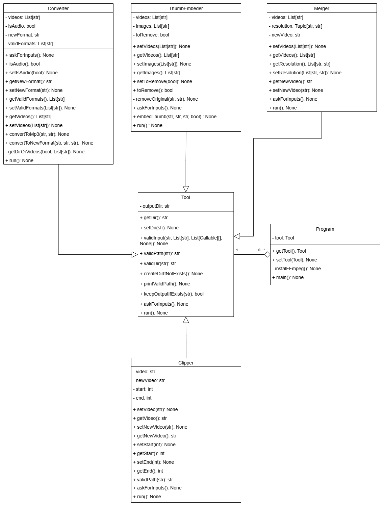

# video-toolbox

## Description

This is a collection of tools for video processing. It is based on the [FFmpeg](https://ffmpeg.org/) library.

## Tools

### Converter

Converts video files to other formats or to audio files.

### Merger

Merges multiple video files into one.

### ThumbEmbeder

Embeds thumbnails into videos.

### Clipper

Makes a clip from the seleted video.

## Usage

### For Windows

1. You can download ffmpeg and add it to the path variable, but the program will do it for you.
2. Download the latest release from [here](https://github.com/ahmedxgouda/video-toolbox/releases/tag/v.1.0.0).
3. Run the program.
4. Select the tool you want to use.
5. Follow the instructions.

### For Linux and MacOS

1. Install ffmpeg.
2. Download the source code.
3. Run python3 main.py
4. Select the tool you want to use.
5. Follow the instructions.

## License

This project is licensed under the MIT License - see the [LICENSE](LICENSE) file for details.

## Acknowledgments

* [FFmpeg](https://ffmpeg.org/)
* [FFmpeg for Windows](https://www.gyan.dev/ffmpeg/builds/)
* [FFmpeg for MacOS](https://evermeet.cx/ffmpeg/)
* [FFmpeg for Linux](https://ffmpeg.org/download.html)

## Class Diagram

